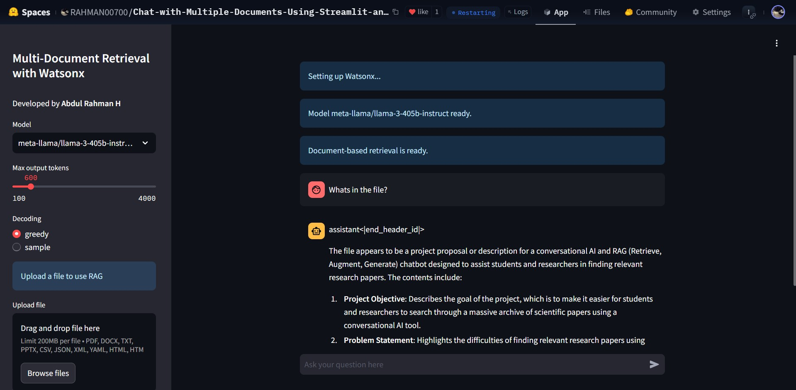

# Multi-Document Retrieval with Watsonx

**A Streamlit-powered app for querying multiple document types using Watsonx and LangChain.**

This project allows users to upload various file formats (PDFs, DOCX, CSV, JSON, YAML, HTML, etc.) and retrieve contextually accurate responses using Watsonx LLM models and LangChain. The app provides a seamless interface to perform retrieval-augmented generation (RAG) from uploaded documents.[Live-app](https://huggingface.co/spaces/RAHMAN00700/Chat-with-Multiple-Documents-Using-Streamlit-and-Watsonx)


---

## Features

- **File Support**: Supports multiple file formats such as PDFs, Word documents, PowerPoint presentations, CSV, JSON, YAML, HTML, and plain text.
- **Watsonx LLM Integration**: Utilize IBM Watsonx's LLM models for querying and generating answers.
- **Embeddings**: Uses `HuggingFace` embeddings for document indexing.
- **RAG (Retrieval Augmented Generation)**: Combines document-based retrieval with LLMs for accurate responses.
- **Streamlit Interface**: Provides an intuitive user experience.

---

## Installation

Follow these steps to clone and run the project locally:

### Prerequisites

1. **Python 3.8+** installed on your system.
2. Install `pip` (Python package manager).
3. An IBM Watsonx API key and Project ID.
4. Install Git if not already installed.

### Clone the Repository

```bash
git clone https://github.com/Abd-al-RahmanH/Multi-Doc-Retrieval-Watsonx.git
cd Multi-Doc-Retrieval-Watsonx
```

### Install Dependencies

1. Create a virtual environment (optional but recommended):

    ```bash
    python -m venv env
    source env/bin/activate  # On Windows: .\env\Scripts\activate
    ```

2. Install required Python packages:

    ```bash
    pip install -r requirements.txt
    ```

### Set Environment Variables

Create a `.env` file in the project directory with the following keys:

```env
WATSONX_API_KEY=<your_watsonx_api_key>
WATSONX_PROJECT_ID=<your_watsonx_project_id>
```

### Run the App

1. Start the Streamlit app by running:

    ```bash
    streamlit run app.py
    ```

2. Open the URL displayed in your terminal (usually [http://localhost:8501](http://localhost:8501)) to access the app.

---

## How to Use

1. **Upload Documents**: Drag and drop supported files (e.g., PDFs, DOCX, JSON) in the app sidebar.
2. **Select Model and Parameters**: Choose a Watsonx model and configure settings like output tokens and decoding methods.
3. **Ask Questions**: Enter queries in the chat input to retrieve answers based on the uploaded document.

---

## Project Structure

```plaintext
Multi-Doc-Retrieval-Watsonx/
├── app.py               # Main application file
├── requirements.txt     # Python dependencies
├── README.md            # Project documentation
└── .env                 # Environment variables (not included in repo, create manually)
```

---

## Dependencies

- **Streamlit**: For building the user interface.
- **LangChain**: For document retrieval and RAG implementation.
- **HuggingFace Transformers**: For embedding and vector representation.
- **Watsonx Foundation Models**: For querying and text generation.
- **Various Python Libraries**: For file handling, including `pandas`, `python-docx`, `python-pptx`, and more.

---

## Contributing

We welcome contributions! If you'd like to improve this project:

1. Fork the repository.
2. Create a feature branch: `git checkout -b feature-name`.
3. Commit your changes: `git commit -m 'Add a new feature'`.
4. Push to the branch: `git push origin feature-name`.
5. Open a Pull Request.

---

## License

This project is licensed under the MIT License. See the [LICENSE](LICENSE) file for details.

---


